 

**1.1** I am Yaganti Lohithnath Reddy, a software engineer and an AI engineer.

**1.2** My base is Hyderabad, India. My degree is Computer Science and Engineering at VIT Vellore. It ends in 2027.

**1.3** A complete product has an interface, a server, a model and a database. A cloud machine keeps it running. I build all of these parts.

**1.4** A model in a notebook does not count until a person can use it. I like work that has a real user at the end.

> [!NOTE]
> 3,270 commits across 23 repositories in 17 languages. Section 7 shows the same data, drawn again every hour.

 

| Item | Equipment | Use |
| :-- | :-- | :-- |
| 2.1 | Python, Go, C++, TypeScript, Rust, Dart, Java, C | Write the code. Python and C++ are used the most. |
| 2.2 | React, Next.js, Flutter, Tailwind | Make web and mobile apps. |
| 2.3 | FastAPI, Go Fiber, Node.js, Express, WebSockets | Make APIs and live connections. |
| 2.4 | PyTorch, OpenCV, LangChain, LangGraph, Hugging Face | Train models. Connect them to products. |
| 2.5 | PostgreSQL, CockroachDB, MongoDB, ChromaDB, Firebase | Store the data. |
| 2.6 | Docker, AWS, GCP, GitHub Actions, Nginx, Linux | Ship the system. Keep it running. |

 

| Date | Location | Task | Result |
| :-- | :-- | :-- | :-- |
| APR 2025 to DEC 2025 | IIT Delhi | Research intern, computer vision. Tested more than 20 video restoration models on real CCTV footage. | Co-wrote a patent: RainMark. |
| MAY 2025 to JUL 2025 | Scientiflow | Frontend intern. Made more than 10 Next.js modules. Rebuilt the FastAPI layer that joins 5 services. | The frontend became approximately 30% faster. Researchers no longer enter data by hand. |

 

**4.1** AI products. These systems read documents or text and answer questions about them.

| Part | Name | What it does | Best part |
| :-- | :-- | :-- | :-- |
| 4.1.1 | [GraphAnchor](https://github.com/Lohithnath2910/GraphAnchor) | Answers questions that need facts from several documents. It joins vector search to a knowledge graph. | Ask who chairs the bank that paid for a wind farm. Plain search names the bank. GraphAnchor names the person. It scored 59.5% against 38.0% on 79 hard questions. |
| 4.1.2 | [Inferra](https://github.com/Lohithnath2910/Inferra) | You upload a PDF and ask a question. A Next.js page shows the answer. | It reads 3 passages, not the whole PDF. |
| 4.1.3 | [Notebound](https://github.com/Lohithnath2910/notebound-be-python) | A chat backend for many PDFs. It cuts each PDF into passages by meaning. | Each PDF stays in its own box, so answers do not mix. The chat remembers what you said. |
| 4.1.4 | [LexiSem](https://github.com/Lohithnath2910/LexiSem) | Takes a sentence and gives the lemma, the part of speech and the meaning of each word in that sentence. | The same word gets a different meaning in each sentence. Feed it an Excel file and it writes the answers back. |

**4.2** Systems and tools. These projects connect hardware, people and servers.

| Part | Name | What it does | Best part |
| :-- | :-- | :-- | :-- |
| 4.2.1 | [Hospitality Assistant](https://github.com/Lohithnath2910/final-round-project) | A multi-tenant assistant for hotels. Guests send messages. Owners ask questions about their data in English or Hinglish. | Ask "revenue kitna tha" and get the number. Ask for another hotel's revenue and the database says no. A guest message takes about half a second. |
| 4.2.2 | [FocusZone](https://github.com/Lohithnath2910/FocusZone) | An ESP32 sensor measures temperature, humidity, light and noise. A Random Forest model finds when the room hurts focus. Gemini 2.0 Flash turns the result into advice. | It does not say "focus more". It says which thing in the room to change. |
| 4.2.3 | [canvas](https://github.com/Lohithnath2910/canvas) | A desktop widget platform. Sticky notes sync between computers. Edit conflicts resolve by themselves. | No Electron. It idles at less than 20 MB of RAM. |
| 4.2.4 | [BackForge](https://github.com/Lohithnath2910/BackForge) | A terminal tool. You define the models, the endpoints and the login type. It exports a complete FastAPI project. | Press one key and a full FastAPI project appears on disk. One more key adds 5 login routes. |
| 4.2.5 | [NFC Payment System](https://github.com/Lohithnath2910/nfc_payment_system) | A phone taps an NFC tag to pay a bus fare. The backend takes the fare and sends a push notification. | A tap buzzes the phone. The notice disappears after 5 minutes. |
| 4.2.6 | [Traffic Control System](https://github.com/SukrutaN/Advanced-Traffic-Control-System-for-Urban-Road-Network) | A Python model of traffic signals on a city road network. Team project. | A fixed timer and signals that react to the road run side by side in two demos. |

 

| Part | Languages | Interface | Server | AI | Data |
| :-- | :-- | :-- | :-- | :-- | :-- |
| GraphAnchor | Python | Web page | Python API | Knowledge graph, spaCy, embeddings | ChromaDB, SQLite |
| Inferra | TypeScript, Python | Next.js, Tailwind | FastAPI | Embeddings, IBM language model | ChromaDB |
| Notebound | Python | None | FastAPI | Embeddings, IBM language model | ChromaDB |
| LexiSem | Python | None | FastAPI | spaCy, Ollama | Excel files |
| Hospitality Assistant | Python, TypeScript | React | Python API, queue worker | NL to SQL, RAG | Supabase PostgreSQL |
| FocusZone | Python, Dart | Flutter | FastAPI | Random Forest, Gemini 2.0 Flash | ThingSpeak |
| canvas | Rust | Slint | WebSockets | Automerge CRDT | SQLite |
| BackForge | Rust | Terminal | Writes FastAPI code | None | Writes SQLAlchemy models |
| NFC Payment System | Dart, Python | Flutter | Python API, Firebase push | None | PostgreSQL |

 

| Type | Title | Issued by |
| :-- | :-- | :-- |
| Patent | RainMark: Unified Framework for Detection and Quantification of Rain Streaks | IIT Delhi |
| Certificate | Generative AI: Foundation Models, Prompt Engineering, Applied GenAI | IBM |
| Hackathon | Winner, Civil Track, 2025 | Yantra Central Hack |
| Hackathon | Qualified, 2025 | Smart India Hackathon |

 

**7.1** A GitHub Action draws these figures again every hour. The data comes from my GitHub account, including private repositories.

 

**8.1** Write a message. Put the subject in the first line.

**8.2** Send the message to [lohithnath2910@gmail.com](mailto:lohithnath2910@gmail.com). Use the table to pick the best way.

| If you want | Do this |
| :-- | :-- |
| An internship or a job | Send an email. Put the role and the team in the first line. |
| Research work | Send an email. Describe the problem and the data. |
| A project or freelance work | Send an email. Give the goal and the date. |
| An answer about my code | Open an issue in the repository. |
| To say hello | Send a message on [LinkedIn](https://www.linkedin.com/in/yaganti-lohithnath-reddy/). |

**8.3** I reply in 2 days or less. [change this to what is true]

**8.4** To see my algorithm practice, go to [LeetCode](https://leetcode.com/u/Lohithnath2910/).

> [!CAUTION]
> Do not send an unclear specification. I will ask questions.

 

