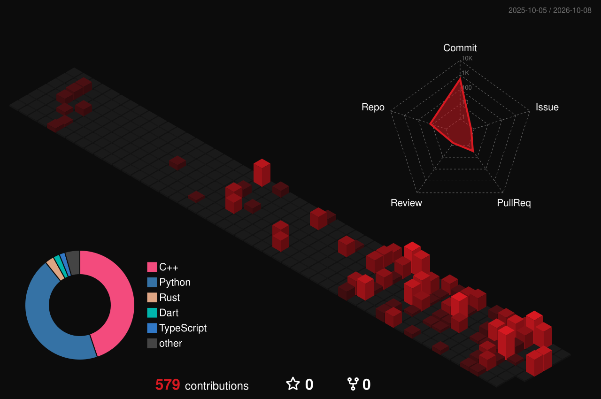

 

**1.1** This data module gives information about Yaganti Lohithnath Reddy.

**1.2** He is a software engineer and an AI engineer. He lives in Hyderabad, India. He studies Computer Science and Engineering at VIT Vellore.

**1.3** He makes full systems. A full system has a user interface, a server, an AI model, a database and cloud infrastructure. He makes all of these parts.

> [!NOTE]
> When data must stay on the system, he runs the language model locally. He does not send the data to a third-party API.

 

| Item | Equipment | Use |
| :-- | :-- | :-- |
| 2.1 | Python, Go, C++, TypeScript, Java, C | Write the code. |
| 2.2 | React, Next.js, Flutter, Tailwind | Make web and mobile interfaces. |
| 2.3 | FastAPI, Go Fiber, Node.js, Express, WebSockets | Make APIs and services. |
| 2.4 | PyTorch, OpenCV, LangChain, LangGraph, Ollama, Hugging Face | Train models. Make RAG pipelines. |
| 2.5 | PostgreSQL, CockroachDB, MongoDB, ChromaDB, Firebase | Keep the data. |
| 2.6 | Docker, AWS, GCP, GitHub Actions, Nginx, Linux | Install and operate the system. |

 

| Date | Location | Task | Result |
| :-- | :-- | :-- | :-- |
| APR 2025 to DEC 2025 | IIT Delhi | Research intern, computer vision. He did tests on more than 20 video restoration models. | One patent: RainMark. |
| MAY 2025 to JUL 2025 | Scientiflow | Frontend intern. He made more than 10 Next.js modules. He changed the FastAPI layer for more than 5 services. | Response time decreased by approximately 30%. |
| 2025 | Yantra Central Hack | He competed in the Civil Track. | Won. |
| 2025 | Smart India Hackathon | He competed. | Qualified. |

 

 

**5.1** Write a message. Put the subject in the first line.

**5.2** Send the message to [lohithnath2910@gmail.com](mailto:lohithnath2910@gmail.com).

**5.3** Alternative: send the message on [LinkedIn](https://www.linkedin.com/in/yaganti-lohithnath-reddy/).

**5.4** Wait for a reply.

**5.5** To see his algorithm practice, go to [LeetCode](https://leetcode.com/u/Lohithnath2910/).

> [!CAUTION]
> Do not send an unclear specification. He will ask questions.

 

